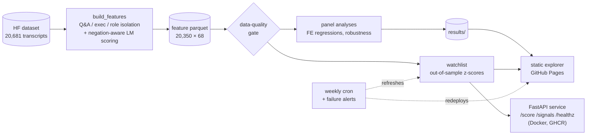

# Earnings Call NLP Risk Signals

**Detecting Hedging Language in Corporate Communications**

[](https://github.com/ahdithanu/earnings-call-nlp-risk-signals/actions/workflows/ci.yml)
[](https://github.com/ahdithanu/earnings-call-nlp-risk-signals/actions/workflows/refresh-signals.yml)
[](LICENSE)
[](https://ahdithanu.github.io/earnings-call-nlp-risk-signals/)

An NLP pipeline that measures uncertainty and hedging language in earnings call transcripts and tests whether it predicts near-term earnings. Uses the Loughran-McDonald finance-specific lexicon over the Q&A sections of the full S&P 500's earnings calls — all 11 GICS sectors, 494 companies, 2013–2025.



## Why This Matters

Earnings calls contain signals beyond the numbers. Executives hedge when they're uncertain — and the unscripted Q&A exchange reveals more than prepared remarks. This project quantifies that hedging systematically and asks the question that matters: does it actually predict anything?

## Key Finding

Tested on 19,081 company-quarters across 494 S&P 500 companies (2013–2025):

- **Elevated hedging is a real, but modest, market-wide bearish signal.** When a company's Q&A uncertainty density rises one standard deviation above its own norm, next-quarter trailing-12M EPS growth comes in about **0.55 percentage points lower** (t = −3.87, ticker fixed effects, ticker-clustered SEs). It survives quarter fixed effects (−0.29pp, t = −2.08, p = 0.038), so it is not just market-wide bad times — though absorbing calendar shocks halves it.
- **The signal lives in executive speech — specifically the CEO's.** Scoring only executive answers (analyst questions stripped out) gives a slightly *stronger* effect than the whole Q&A (−0.34pp vs −0.29pp under ticker+quarter FE). Splitting executives by role: **CEO hedging carries the signal (−0.57pp, p = 0.001); CFO hedging carries none (−0.17pp, p = 0.29)**, CEO and CFO hedging are nearly uncorrelated (r = 0.19), and the CEO effect holds in both transcript-format eras and when both enter jointly. See [`results/exec_roles_analysis.txt`](results/exec_roles_analysis.txt).
- **It overlaps with directional tone — the honest caveat, larger at market scale.** Under ticker FE the uncertainty effect survives each LM tone control individually (−0.32 to −0.54pp, all p < 0.05). Under the stricter ticker+quarter FE it slips below significance once negative (p = 0.23) or positive (p = 0.21) tone is absorbed, and all four controls jointly leave ≈ −0.07pp (n.s.). Directional tone is the stronger channel market-wide — negative ≈ −1.1 to −1.7pp, positive ≈ +0.8 to +1.1pp per SD — with hedging adding modest incremental signal.
- **It is the level that predicts, not the trend.** The standing hedging *level* carries the signal (−0.67pp, p = 0.004, ticker FE); the quarter-over-quarter *change* adds none (momentum ≈ +0.06, p = 0.64).
- **Per-company correlations are weak but collectively real.** Across 480 tickers with 12+ quarters, correlations center near zero (mean r = −0.045), yet 45/480 clear p < 0.05 — about double the ≈24 expected by chance. An earlier version of this project reported strong per-company correlations (NVDA +0.96, MSFT −0.58) from ~3 quarters of data; on 40+ quarters those numbers do not replicate. Small samples tell vivid stories; panels tell true ones.

Full output: [`results/uncertainty_growth_analysis.txt`](results/uncertainty_growth_analysis.txt) · [`results/per_ticker_correlations.csv`](results/per_ticker_correlations.csv) · [`results/execqa_robustness.txt`](results/execqa_robustness.txt).

## Where is the signal concentrated?

Per-sector ticker-fixed-effects estimates ([`scripts/analyze_cross_sector.py`](scripts/analyze_cross_sector.py)) show the market-wide effect is **real but uneven**:

- Strongest in **Information Technology** (−0.89pp, p = 0.003) — where this project's first, narrower version found it — and also significantly negative in **Financials** (−0.53pp, p = 0.003) and **Consumer Staples** (−0.43pp, p = 0.026). Negative in **8 of 11 sectors**.
- **Absent** in Health Care, Energy, and Materials (flat/positive, non-significant) — plausibly real economics: commodity-price-driven and binary-clinical-event businesses have uncertainty structures that executive hedging does not proxy the same way.

Full table: [`results/cross_sector_robustness.txt`](results/cross_sector_robustness.txt) · [`results/cross_sector.csv`](results/cross_sector.csv).

## Price outcomes (post-call drift)

Does hedging predict the *stock*, not just EPS? [`scripts/fetch_prices.py`](scripts/fetch_prices.py) builds a post-call return outcome — the immediate 5-day reaction and the ~1-quarter drift — from [Financial Modeling Prep](https://financialmodelingprep.com/), and [`scripts/analyze_price_drift.py`](scripts/analyze_price_drift.py) runs the *same* fixed-effects test with the return as the outcome. The drift math is unit-tested; because the fetch needs a price-API key and open network egress, it runs via the `price-outcomes` GitHub Actions workflow — add an `FMP_API_KEY` repo secret (Settings → Secrets and variables → Actions) and dispatch it. Results land in `results/price_drift.txt`.

## Forward-Looking Signals

`scripts/latest_signals.py` turns the panel finding into a monitoring view: each ticker's most recent call is z-scored against that company's *prior* calls only (strictly out-of-sample), producing a watchlist of names whose executives are hedging unusually hard right now — [`results/latest_uncertainty_signals.csv`](results/latest_uncertainty_signals.csv). The report is only as fresh as the dataset (currently through 2025Q1); a `quarters_behind` column flags stale tickers.

**Explore it:** `web/` is a static, self-contained explorer — per-company density-vs-growth charts for all 494 tickers, a **"hedging now" watchlist** ranking who is hedging most versus their own history (out-of-sample), and the panel result up top, live at [ahdithanu.github.io/earnings-call-nlp-risk-signals](https://ahdithanu.github.io/earnings-call-nlp-risk-signals/). The validated panel ends at 2025Q1; `scripts/fetch_recent_signals.py` extends each company's density series through 2026Q2 using a live transcript source ([Rogersurf/earnings-call-transcripts](https://huggingface.co/datasets/Rogersurf/earnings-call-transcripts)), calibrated to the panel's density scale on the ~90 company-quarters the two sources share (corr 0.94). Those recent quarters carry the hedging signal only — their next-quarter EPS is not yet realized — and never enter the regression. Regenerate the page with `scripts/export_web_data.py`.

## Scoring API

The scorer behind the pipeline is also a deployable service (`earnings_signals/api.py`):

```bash
make serve                       # local:  uvicorn earnings_signals.api:app --reload
docker compose up                # containerized, live-reload
docker pull ghcr.io/ahdithanu/earnings-signals-api:latest   # published on version tags
```

- `POST /score` — negation-aware uncertainty + LM tone densities for every scope derivable from the submitted text (full / Q&A / executive-only / CEO / CFO), with isolation flags and role provenance
- `GET /signals` — the latest hedging watchlist
- `GET /healthz` — liveness + lexicon sanity; interactive docs at `/docs`

Point the explorer's `signals-api` meta tag at a deployed instance and the site gains a live "score your own text" section (it stays fully static otherwise).

## Methodology

1. **Data:** [glopardo/sp500-earnings-transcripts](https://huggingface.co/datasets/glopardo/sp500-earnings-transcripts) — 20,681 S&P 500 earnings-call transcripts with quarter keys, GICS sector, and trailing/forward 12-month EPS. The panel is the full S&P 500 — all 11 GICS sectors, 494 tickers, 20,350 deduplicated company-quarters (GOOG and NWS dropped as duplicate share classes carrying the same calls as GOOGL/NWSA). The universe is defined in one place (`earnings_signals/universe.py`); the site's headline counts are derived from the data, so changing the universe is a single edit plus a rerun — no hardcoded numbers to chase.
2. **Q&A isolation:** transcripts are a single speaker-prefixed string, so the Q&A boundary is found by position-aware markers (explicit "Question-and-Answer Session" header, falling back to the operator's first-question handoff; intro announcements are ignored). 98% of transcripts split cleanly; the rest are flagged rather than silently mis-scored. Within the Q&A, speaker attribution (roster + prepared-remarks speakers) isolates **executive-only answers** (98%), and roster titles or IR-intro prose assign **CEO/CFO roles** (95.6%; parsed names validated at 87.7% surname continuity across the dataset's 2018/2019 format change, most mismatches being genuine executive transitions — [`results/role_name_continuity.txt`](results/role_name_continuity.txt)).
3. **Uncertainty scoring:** negation-aware matching against the full 297-term Loughran-McDonald uncertainty category — "no material risk" does not count as risk. Density = uncertainty terms per 100 tokens, computed for five scopes: full call, Q&A section, executive-only answers, CEO answers, CFO answers.
4. **Outcome variable:** next-quarter trailing-12M EPS growth, with a calendar-gap guard so a missing quarter yields NaN instead of a fabricated "next quarter."
5. **Analysis:** per-ticker correlation sweep (Pearson + Spearman), ticker fixed-effects panel regression with ticker-clustered standard errors, growth-context test, lead-lag comparison, tone-control regressions against the other LM categories (negative, positive, litigious, constraining), and a hedging-momentum (level vs. QoQ change) check. Growth winsorized at 1%/99%; Q&A sections under 500 tokens excluded.

## Repository Structure

```
├── data/processed/
│   ├── sp500_uncertainty_features.parquet  # 20,350 rows × 68 cols: ids + metrics, no transcript text
│   └── recent_uncertainty_signals.parquet  # calibrated 2025Q2–2026 density for the explorer
├── results/
│   ├── uncertainty_growth_analysis.txt     # headline analysis output
│   ├── per_ticker_correlations.csv         # all 480 per-ticker correlations
│   ├── cross_sector_robustness.txt         # per-sector heterogeneity of the panel effect
│   ├── cross_sector.csv                    # per-sector coefficients
│   ├── execqa_robustness.txt               # exec-only vs full-Q&A scoring comparison
│   ├── exec_roles_analysis.txt             # whose hedging carries the signal: CEO vs CFO
│   ├── role_name_continuity.txt            # parsed exec names validated across format change
│   ├── latest_uncertainty_signals.csv      # latest call per ticker, scored vs own history
│   └── panel_stats.json                    # derived headline stats (n, coefs, p) the site reads
├── scripts/
│   ├── inspect_dataset.py                  # Step 1: schema inspection (run before mapping fields)
│   ├── build_features.py                   # Steps 2–6: dataset → feature parquet
│   ├── fetch_recent_signals.py             # calibrated 2025Q2–2026 density (explorer only)
│   ├── analyze_uncertainty_growth.py       # panel analysis
│   ├── analyze_cross_sector.py             # per-sector heterogeneity breakdown
│   ├── analyze_execqa_robustness.py        # exec-only vs full-Q&A robustness
│   ├── analyze_exec_roles.py               # CEO-vs-CFO role analysis
│   ├── validate_role_names.py              # cross-reference parsed exec names
│   ├── fetch_prices.py                     # post-call prices from FMP (needs FMP_API_KEY)
│   ├── analyze_price_drift.py              # does hedging predict returns, not just EPS?
│   ├── latest_signals.py                   # forward-looking monitoring report
│   └── export_web_data.py                  # renders self-contained web/index.html from the parquet
├── web/                                    # self-contained explorer: index.template.html (source) → index.html (generated, data inlined)
├── earnings_signals/
│   ├── lexicon.py                          # LM lexicon loader (refuses truncated lists)
│   ├── uncertainty.py                      # tokenizer + negation-aware uncertainty counting
│   ├── qa_extract.py                       # Q&A boundary detection
│   ├── qa_isolation.py                     # executive-only answer attribution within the Q&A
│   ├── exec_roles.py                       # CEO/CFO/IR role attribution (roster + intro prose)
│   ├── features.py                         # forward EPS shift with quarter-gap guard
│   ├── price_drift.py                      # post-call return math (unit-tested)
│   └── universe.py                         # the universe rule — single edit point to change scope
├── tests/                                  # 43 unit tests
├── lm_uncertainty_terms.txt                # full 297-term LM uncertainty category
├── lm_negative_terms.txt                   # full 2,355-term LM negative category (tone control)
├── lm_positive_terms.txt                   # full 354-term LM positive category (tone control)
├── lm_litigious_terms.txt                  # full 904-term LM litigious category (tone control)
└── lm_constraining_terms.txt               # full 184-term LM constraining category (tone control)
```

## Quick Start

```bash
pip install -r requirements.txt
python -m pytest tests/            # 43 tests
python -m scripts.build_features   # rebuilds the parquet (downloads dataset on first run)
python -m scripts.analyze_uncertainty_growth
python -m scripts.latest_signals       # score each ticker's most recent call
python -m scripts.fetch_recent_signals # calibrated 2025Q2–2026 quarters (explorer)
python -m scripts.export_web_data      # render web/index.html (panel + recent, data inlined)
```

Score any text directly:

```python
from src.lexicon import load_uncertainty_terms
from src.uncertainty import count_uncertainty

lexicon = load_uncertainty_terms()
result = count_uncertainty(
    "We believe revenue could potentially exceed expectations, "
    "though there is no material risk to our guidance.", lexicon,
)
print(result.uncertainty_count, result.negation_excluded, result.density)
```

## Data Sources

- **Transcripts + EPS (validated panel, 2013–2025Q1):** [glopardo/sp500-earnings-transcripts](https://huggingface.co/datasets/glopardo/sp500-earnings-transcripts) (Hugging Face)
- **Recent transcripts (explorer signal, through 2026):** [Rogersurf/earnings-call-transcripts](https://huggingface.co/datasets/Rogersurf/earnings-call-transcripts) (Hugging Face)
- **Uncertainty Dictionary:** [Loughran-McDonald Master Dictionary](https://sraf.nd.edu/loughranmcdonald-master-dictionary/)

## Roadmap

- [x] Q&A isolation recovery — operator analyst-handoff fallback (95.8% → 98.4%)
- [x] LM tone controls — negative, litigious, constraining (uncertainty survives all three)
- [x] Executive-only scoring — analyst questions stripped from the signal (98% attribution)
- [x] CEO/CFO role split — roster + intro-prose attribution, validated across the 2018/2019 format change; CEO hedging is the carrier
- [x] Full S&P 500 primary panel — all 11 GICS sectors, sector heterogeneity as an analysis dimension
- [x] Price-based outcomes scaffolded — post-call drift fetch + regression + CI workflow (activate with an `FMP_API_KEY` secret)

## License

MIT License

## Author

**Ahdithan Uthayakumar**
[LinkedIn](https://linkedin.com/in/ahdithan) · [GitHub](https://github.com/ahdithanu)
